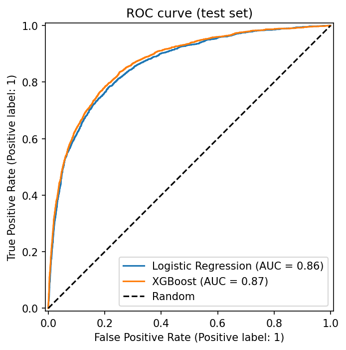
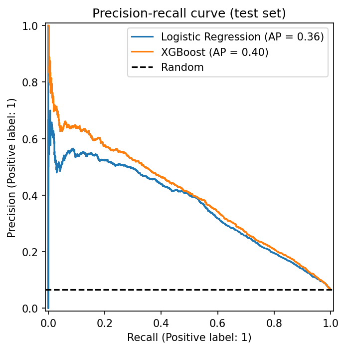
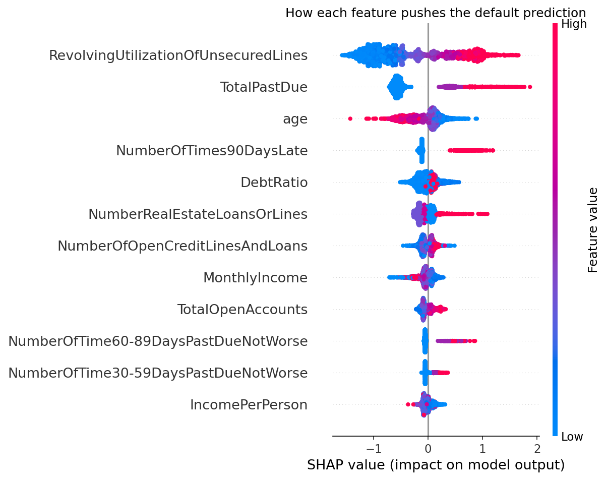

# Credit Risk Scoring System

An end-to-end machine learning project that predicts whether a loan applicant will experience serious delinquency within two years, and **explains every prediction** with SHAP. It covers the full lifecycle: data cleaning, feature engineering, model comparison, evaluation, explainability, a REST API, tests and Docker.

**Dataset:** [Give Me Some Credit](https://www.kaggle.com/c/GiveMeSomeCredit) (Kaggle), 150,000 borrowers, about 6.7% defaults.

## Results

All numbers are on a held-out test set (30,000 applicants) that was never used for training or model selection.

| Model | ROC-AUC | PR-AUC |
|---|---|---|
| Logistic Regression (baseline) | 0.86 | 0.36 |
| **XGBoost (selected)** | **0.87** | **0.40** |

At the chosen decision threshold, XGBoost catches roughly half of the defaulters (recall about 0.48) with precision about 0.42. PR-AUC is reported next to ROC-AUC because with only 6.7% positives, accuracy is misleading (a model that always predicts "no default" scores 93% accuracy).

| ROC curve | Precision-recall curve |
|---|---|
|  |  |

### Explainability

The top drivers of predicted risk are credit utilization, past-due history and age, which matches how credit risk works in practice.



## Key design decisions

- **No data leakage:** the train/test split happens before any learning step. Imputation medians are learned from training data only, inside a scikit-learn `Pipeline`. Cross-validation is run on the training set only.
- **Imbalance handled properly:** class weights (`class_weight="balanced"`, `scale_pos_weight`), PR-AUC as a key metric, and a decision threshold chosen from out-of-fold training predictions (maximizing F1), not from the test set.
- **Data quality rules:** removes impossible ages, converts the placeholder codes 96 and 98 in the past-due columns to missing values, and caps extreme outliers.
- **Engineered features:** missing-value flags, total past-due count, total open accounts, income per household member.
- **Explainable by design:** each API response includes the top three SHAP factors behind the score.
- **Reproducible:** fixed random seeds, pinned XGBoost version range, containerized API.

## Project structure

```
credit-risk-scoring/
├── api/main.py            # FastAPI service
├── src/
│   ├── config.py          # paths and constants
│   ├── data_prep.py       # cleaning and train/test split
│   ├── features.py        # feature engineering and preprocessing pipeline
│   ├── train.py           # model training and cross-validated comparison
│   ├── evaluate.py        # test-set evaluation, plots, threshold selection
│   ├── explain.py         # SHAP global and per-applicant explanations
│   └── predict.py         # scoring module used by the API
├── tests/                 # pytest unit and API tests
├── notebooks/eda.ipynb    # exploratory data analysis
├── reports/               # generated plots and metrics
├── Dockerfile
├── requirements.txt
├── requirements-api.txt   # minimal pinned dependencies for the container
└── pytest.ini
```

## Quick start

**1. Set up the environment** (Python 3.10 or newer)

```bash
python -m venv venv
# Windows PowerShell: venv\Scripts\Activate.ps1
# Mac/Linux:          source venv/bin/activate
pip install -r requirements.txt
```

**2. Get the data:** download `cs-training.csv` from the [Kaggle competition page](https://www.kaggle.com/c/GiveMeSomeCredit/data) and place it at `data/raw/cs-training.csv`.

**3. Run the pipeline**

```bash
python -m src.data_prep    # clean and split
python -m src.train        # compare models, save the best one
python -m src.evaluate     # test metrics, plots, decision threshold
python -m src.explain      # SHAP plots
python -m src.predict      # score two example applicants
```

**4. Run the tests**

```bash
python -m pytest -v
```

## API

Start the service (after running the pipeline above):

```bash
uvicorn api.main:app --reload
```

Open http://127.0.0.1:8000/docs for interactive documentation, or call it directly:

```bash
curl -X POST http://127.0.0.1:8000/predict \
  -H "Content-Type: application/json" \
  -d '{"revolving_utilization": 0.65, "age": 38, "past_due_30_59": 1, "debt_ratio": 0.4, "monthly_income": 5200, "open_credit_lines": 6, "times_90_days_late": 0, "real_estate_loans": 1, "past_due_60_89": 0, "dependents": 2}'
```

Example response:

```json
{
  "risk_score": 0.54,
  "threshold": 0.79,
  "decision": "low_risk",
  "top_factors": [
    {"feature": "RevolvingUtilizationOfUnsecuredLines", "value": 0.65, "effect": "increases risk", "impact": 0.61}
  ]
}
```

(The response contains three factors. The values above are illustrative.)

Endpoints: `GET /health` and `POST /predict`. Inputs are validated (for example, age must be 18 or older, and `monthly_income` and `dependents` are optional).

## Docker

The model files are not stored in the repository, so run the pipeline first (steps 2 and 3 above), then:

```bash
docker build -t credit-risk-api .
docker run --rm -p 8000:8000 credit-risk-api
```

Open http://localhost:8000/docs.

## Limitations

- The `risk_score` is a **ranking score, not a calibrated probability**, because the models are trained with class weights. Calibrate it (for example with isotonic regression) before using it as a literal default probability.
- The model is trained on a single public dataset. It has not been tested for fairness across demographic groups, which any real credit-scoring deployment would require.
- The decision threshold balances precision and recall equally (F1). A real lender would set it from the relative cost of a missed default versus a rejected good customer.

## Tech stack

Python, pandas, NumPy, scikit-learn, XGBoost, SHAP, FastAPI, Pydantic, pytest, Docker.

## Author

**Hema** · [GitHub](https://github.com/hema-ai-tech) · [LinkedIn](https://linkedin.com/in/hema-ai-tech)

## License

MIT. See [LICENSE](LICENSE).